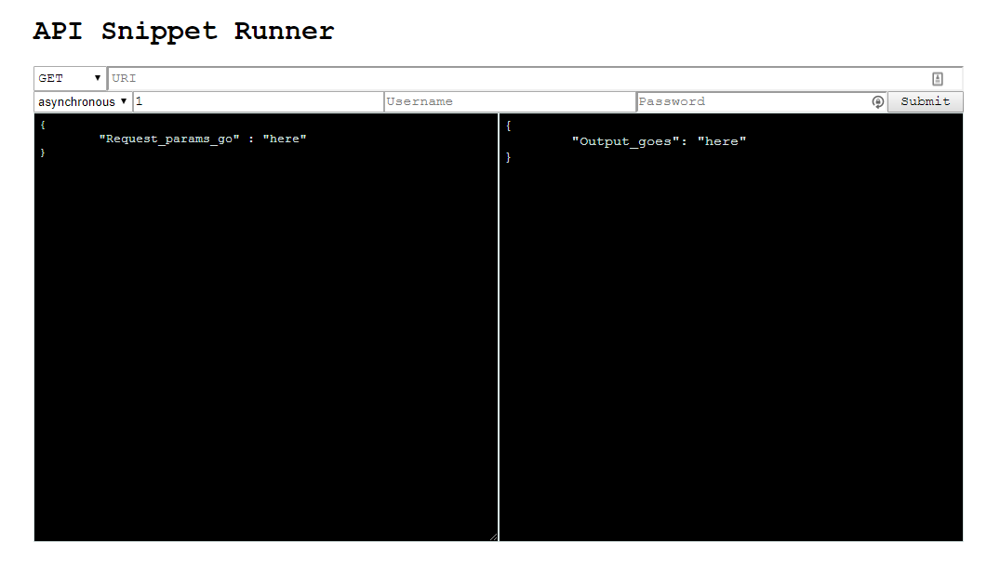

## API Snippet Runner
### About
This is a web page that can be used to do pretty much any (Basic Auth) API testing you need, all from within the browser!

This was originally developed by me as a test harness for a project when other standard API runners couldn't do the specific tasks our team needed or weren't technically allowed to be installed on the corporate computers in the first place. 

All the code for this project is located in a single HTML file so that it can even be used on locked-down corporate computers that cannot easily download new software, and can be sent to colleagues over email without the corporate network freaking out about JS files.



### What it does
In short, is an interface to send Basic Authorized API requests and to receive their output.

With a bit more detail: Takes in a method (GET, POST, PUT, DELETE), a URI, a username, a password, and a request body, and will send that off and display the returned values. If you're trying to stress test **your own** API, you can also choose to send the request multiple times, either synchronously or asynchronously. 

Although the requests are made via AJAX, the URL is updated each time a request is submitted so that you can use the browser history to go back to previous requests or you can send a link with a particular request to a colleague to try out. This is obviously character limited by the length of a URL.

Please note that, if this page will not be hosted on your project's domain and you you don't allow cross-origin requests, you may have to deal with some CORS issues that prevent the intended results from being returned.

### Get it running
* From file (query history might not work in some browsers):

    * Open the HTML file as-is in your browser of choice.

* Using python3 static server:
        
    ```python3
    python3 -m http.server 8000
    ```
* Using any other static server
    * Set up the static server in the directory the file is in and then just access the file through localhost


### Potential future updates (if I feel like it)
* Allow choice of Auth type
* Hide the multi-request stuff so people don't do it accidentally spam endpoints